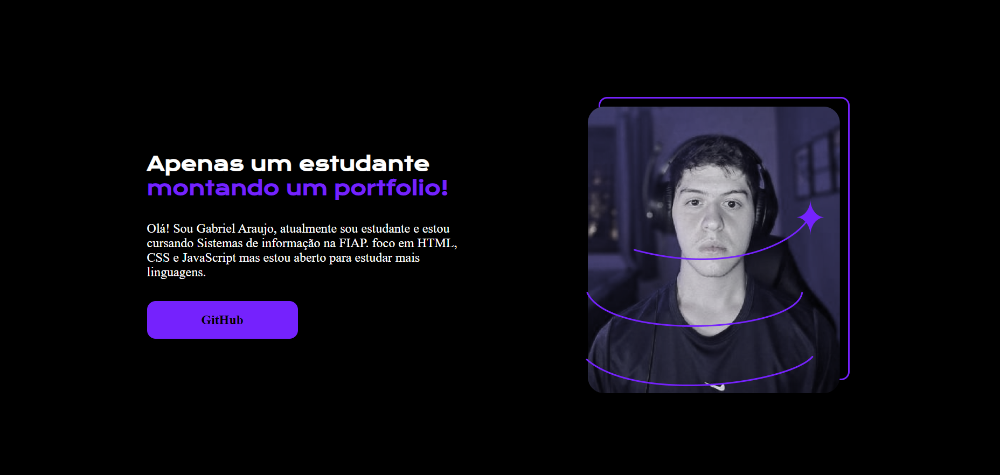

<h1 align = "center"> Portfolio <h1>
<h3 align = "center"> By Bieelx <h3>

Portfolio feito com a ajuda dos cursos HTML e CSS: ambientes de desenvolvimento, estrutura de arquivos e tags & HTML e CSS: Classes, posicionamento e Flexbox.  

## 🚀 Tecnologias

Esse projeto foi desenvolvido com as seguintes tecnologias:
- HTML
- CSS

## 💻 Projeto
Monte um portfolio.
